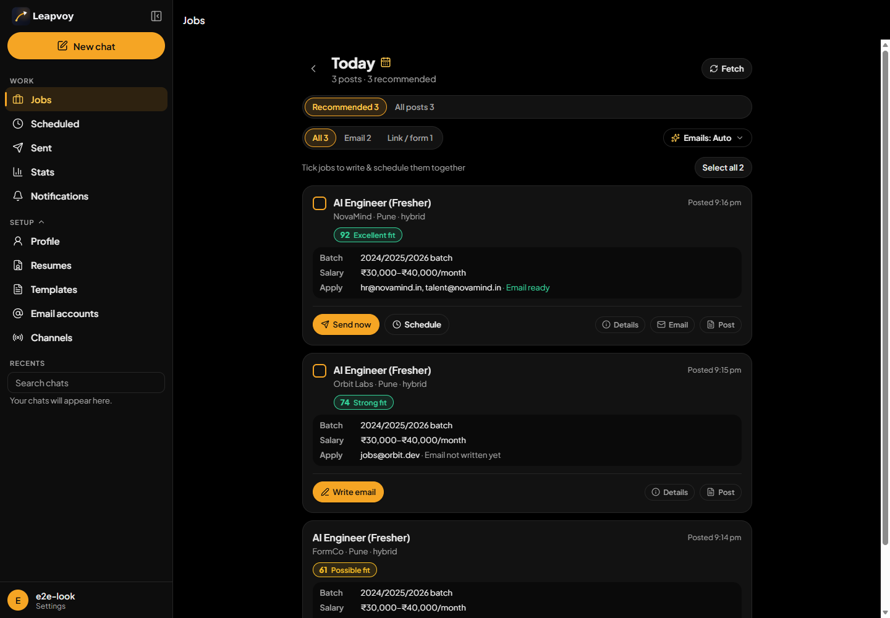
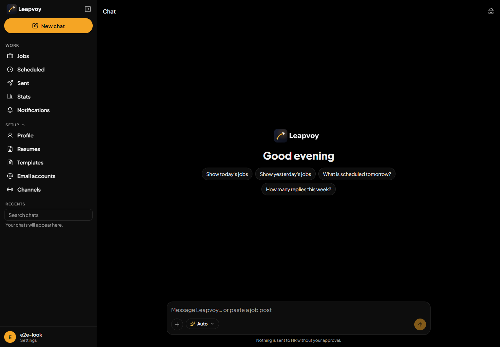
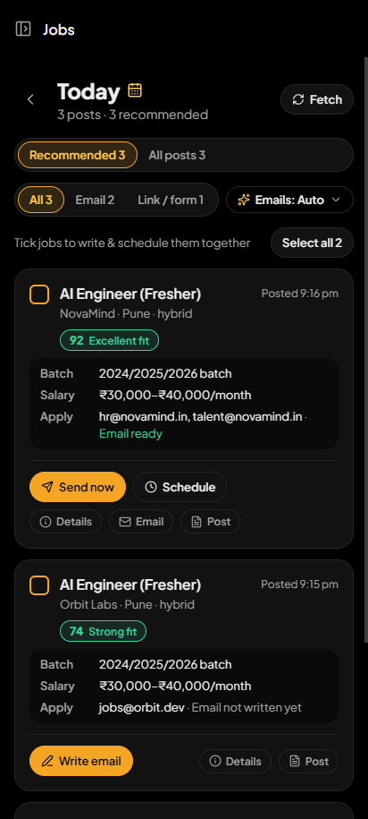
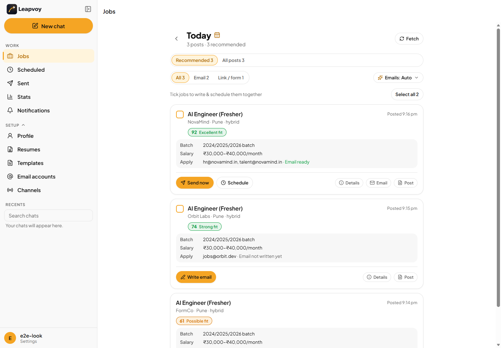
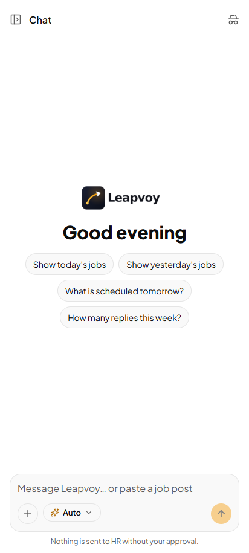
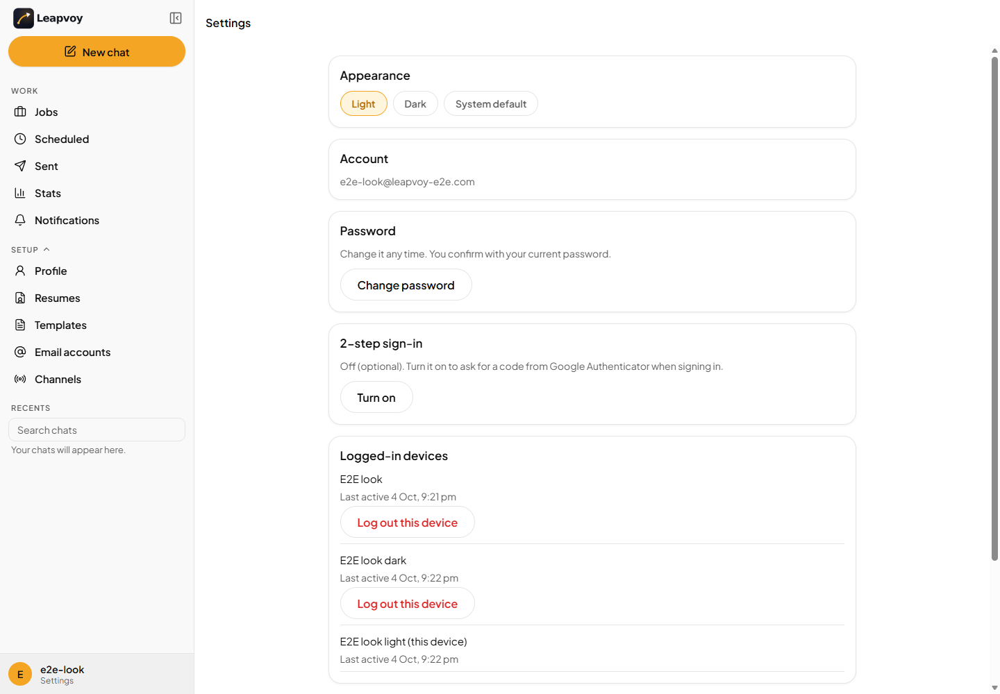
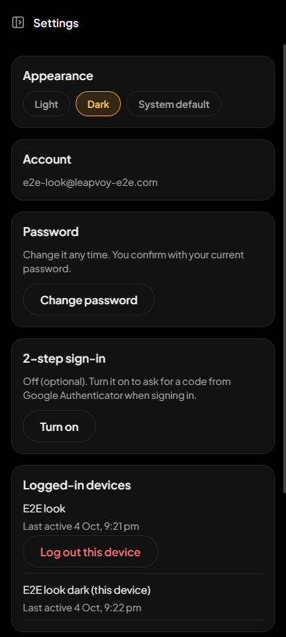
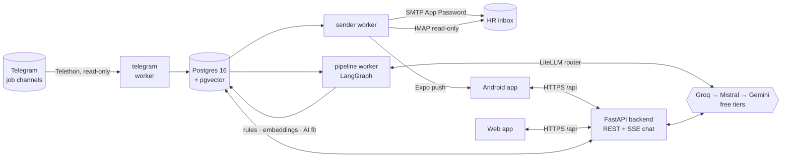
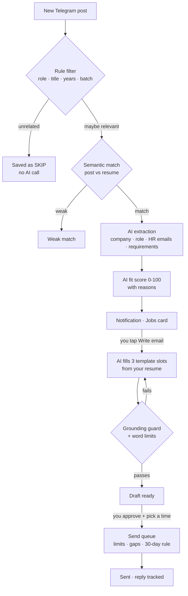

<div align="center">

<picture>
  <source media="(prefers-color-scheme: dark)" srcset="brand/png/wordmark-dark.png">
  
</picture>

### Your personal AI job-outreach agent

**Reads job channels on Telegram → finds the roles that fit your resume → writes a grounded, personal email to HR →
sends it at the right time, safely. Controlled from one app on Android and the web.**

<br>


<br>



</div>

---

## Why Leapvoy

Job channels on Telegram post dozens of openings a day, each with an HR email and a different set of
requirements. Applying well means reading every post, checking the fit honestly, and writing a tailored email
before the role fills up. That is hours of repetitive work a day.

Leapvoy does the reading, the matching and the writing, **and leaves the decision to you**: nothing reaches an HR
inbox without your approval, and every claim in an email is checked against your real resume.

| | |
|---|---|
| **Real data, real volume** | 30-80 posts a day from live channels; about 70% are filtered out before any AI call |
| **Grounded writing** | Every tool, name and number in an email must exist in the resume or profile, or it is rewritten |
| **Safe sending** | Per-sender daily limits, random 3-8 minute gaps, one mail per HR per 30 days, never sent twice |
| **Runs 24/7 for ₹0** | Oracle Cloud Always Free, free AI tiers with automatic fallback, self-healing containers |

## Features

### 🔎 Finds the right jobs
- **Telegram reader** (read-only, Telethon): live listener plus catch-up after any downtime, backfill up to 90 days,
  per-channel on/off. Connect by **scanning a QR code** (or phone + code + 2-step password).
- **Three-stage filter** so the AI only sees what matters: rule filters (role family, title backstop, years of
  experience, batch) → **semantic match** of post vs resume (`bge-small-en-v1.5` embeddings in pgvector) → **AI
  extraction and fit score** (structured JSON via Instructor).
- Professional fit grades (**Excellent · Strong · Good · Possible · Not a fit**) with the reasons, requirements and
  every HR address, plus Google Form / apply-link jobs.
- **Auto-check**: opening a day checks its waiting posts by itself; cards fill in live.

### ✍️ Writes emails that sound like you
- An approved template where the AI writes **only three slots** (opening, proof bullets, closing) from your active
  resume; everything else is fixed text from your profile.
- **Grounding guard** + word limits + rewrite loop; drafts that still fail are flagged for review, never sent.
- **Editable template** with `{tags}`, live preview and versions (sandboxed: no template code can run).
- Respects the post: exact subject lines or Job IDs when the post asks for them; one email to all HR addresses of a
  post.

### 📬 Sends safely, on your schedule
- Approve one job or **select many → "Write & schedule N emails"** (now, tomorrow 10 AM, or any date and time).
- **Test mode on by default**: every mail goes to your own inbox, marked `[TEST]`, until you switch it off.
- Crash-safe queue: gaps and daily limits are recomputed from real send times, so a server restart never causes a
  burst. Reply tracking over IMAP (read-only).

### 💬 A chat agent that can do everything
- "Show today's jobs", "what's scheduled tomorrow?", "send the NovaMind one at 10" → tool calls rendered as
  **cards with Confirm / Dismiss**; nothing irreversible happens without a tap.
- Streaming answers (SSE) with live status ("Reading Telegram…"), chat history with search, pin and rename,
  incognito chats, attachments (PDF incl. scanned via OCR, DOCX, images, screenshots of job posts).
- **Model picker**: Auto or any of six free models, with per-model usage left today.

### 📱 One app, Android and web
- Expo / React Native, one TypeScript codebase: same features on both, layout adapted (sliding sidebar on phones).
- **Push notifications** (good new fits grouped, HR replies, failures, new sign-ins) with quiet hours and a 9 AM
  summary; an in-app inbox on the web.
- Offline saved copy, "server is off" banner, instant open, pure black / pure white themes, a custom opening
  animation, subtle haptics.

### 🔐 Secure by design
- Argon2 passwords, optional **TOTP 2-step sign-in** with backup codes, per-device JWT with rotating refresh tokens,
  remote sign-out, rate limits.
- Telegram sessions and email App Passwords **encrypted with AES-GCM**, bound to the user.
- **Every table scoped by `user_id`**, with isolation tests. Account deletion with a 7-day undo window.
- Public server hardening: sign-ups close after the owner's account, API docs off, only HTTPS exposed.

## Screenshots

<table>
  <tr>
    <td width="66%"></td>
    <td width="34%"></td>
  </tr>
  <tr>
    <td><sub><b>Chat agent</b>: ask in plain words, act through confirm cards</sub></td>
    <td><sub><b>Jobs on Android</b></sub></td>
  </tr>
  <tr>
    <td></td>
    <td></td>
  </tr>
  <tr>
    <td><sub><b>Jobs</b>: fit score, batch, salary, how to apply, one main action</sub></td>
    <td><sub><b>Light theme</b></sub></td>
  </tr>
  <tr>
    <td></td>
    <td></td>
  </tr>
  <tr>
    <td><sub><b>Settings</b>: password, 2-step sign-in, devices</sub></td>
    <td><sub><b>Settings on Android</b></sub></td>
  </tr>
</table>

<sub>Screenshots use a demo account with sample data.</sub>

## Architecture



| Part | What it does |
|---|---|
| `backend` | FastAPI: auth, chat agent (SSE), jobs, scheduling, settings, notifications, stats |
| `telegram` | Live listener + catch-up; stores raw posts per user |
| `pipeline` | LangGraph graph: filter → match → extract → fit score; pauses itself before free AI quotas run out |
| `sender` | Due emails with every safety rule, reply tracking, push notifications, nightly maintenance |
| `web` | nginx: serves the Expo web build at `/`, proxies `/api` to the backend (one origin, no CORS) |
| `db` | Postgres 16 + pgvector, 18 Alembic migrations |

### How a post becomes an email



**AI routing:** every call goes through one LiteLLM router with JSON-schema output. Groq (`gpt-oss-120b`,
`gpt-oss-20b`, `qwen3`) first, then Mistral (Ministral) and Gemini Flash as backups. Token usage is recorded per
model per day; background work pauses before the free quota runs out so chat always has a reserve, and an unreachable
provider never counts as a failed attempt.

## Tech stack

| Layer | Technology |
|---|---|
| **Backend** | Python 3.12 · FastAPI · Pydantic v2 · SQLAlchemy 2 (async) + asyncpg · Alembic · structlog |
| **AI** | LangGraph · LiteLLM · Instructor (structured output) · fastembed (`bge-small-en-v1.5`, ONNX, no PyTorch) · RapidOCR |
| **Data** | Postgres 16 + pgvector |
| **Integrations** | Telethon (Telegram) · aiosmtplib (SMTP) · imap-tools (IMAP) · Expo Push (FCM) |
| **Security** | argon2 · PyJWT · pyotp (TOTP) · AES-GCM (cryptography) · slowapi rate limits |
| **App** | Expo SDK 57 · React Native 0.86 · React 19 · Expo Router · TypeScript · TanStack Query · Reanimated 4 · react-native-svg |
| **Infra** | Docker Compose · nginx · systemd timers · Tailscale Funnel · Oracle Cloud Always Free (ARM) · EAS Build |
| **Tooling** | uv (workspace, lockfile) · pytest + pytest-asyncio (real Postgres via pgserver) · ESLint · `tsc --noEmit` |

## Project structure

```
leapvoy/
├── backend/
│   ├── app/
│   │   ├── accounts/     # sign-up, login, 2-step sign-in, recovery, account deletion
│   │   ├── api/          # FastAPI routers (auth, chat stream, jobs, settings, telegram, stats, ...)
│   │   ├── chat/         # chat agent, tools, confirm-card actions, attachments
│   │   ├── core/         # config, crypto (AES-GCM), logging, worker heartbeat
│   │   ├── db/           # SQLAlchemy models + Alembic migrations
│   │   ├── llm/          # LiteLLM router, prompts, schemas, usage tracking
│   │   ├── mailer/       # template rendering, drafts + guard, send queue, replies
│   │   ├── pipeline/     # rules, embeddings match, LangGraph extract + fit
│   │   ├── telegram/     # Telethon client, reader, session store
│   │   ├── workers/      # telegram_reader, pipeline, sender (long-running processes)
│   │   └── notify.py     # notification rules + Expo push
│   ├── tests/            # pytest suite against real Postgres + pgvector
│   ├── scripts/          # dev runner, DB export, Oracle capacity helper
│   └── Dockerfile
├── mobile/               # Expo app (Android + web): src/app (screens), src/components, src/lib
├── deploy/               # docker-compose, nginx, the `leapvoy` ops command, systemd timers
├── docs/                 # DEPLOYMENT.md, email template, screenshots
├── brand/                # logo, icons, wordmarks, theme tokens
└── tools/eas/            # EAS CLI, kept out of the app's dependencies
```

## Getting started (local development)

**Requirements:** [uv](https://docs.astral.sh/uv/), Node.js 20+, a Telegram API ID, a free Groq API key. No Docker
needed locally: tests and the dev runner start a private Postgres + pgvector automatically (`pgserver`).

```bash
git clone https://github.com/ChetanMahajan715/leapvoy.git
cd leapvoy
cp .env.example .env          # fill in the keys (see comments inside)
uv sync                       # one .venv for the whole workspace

# backend: starts Postgres, runs migrations, serves the API on :8000
cd backend
uv run python scripts/dev.py python -m uvicorn app.main:app --port 8000

# web app (second terminal)
cd mobile
npm ci
npx expo start --web          # http://localhost:8081
```

Workers (each in its own terminal, from `backend/`):
```bash
uv run python scripts/dev.py python -m app.workers.telegram_reader
uv run python scripts/dev.py python -m app.workers.pipeline
uv run python scripts/dev.py python -m app.workers.sender
```

## Tests

```bash
cd backend && uv run pytest          # 430+ tests on a real Postgres 16 + pgvector
cd mobile && npx tsc --noEmit && npx expo lint && npm test
```

The suite covers the pipeline rules, AI router fallbacks (with fake providers), template rendering against
approved samples, every sending safety rule, auth and 2-step sign-in, per-user data isolation, notifications,
Telegram login flows (with a fake Telegram), and a repository-wide style check.

## Deployment

Leapvoy runs 24/7 on an **Oracle Cloud Always Free** ARM VM with Docker Compose, reachable over HTTPS through
**Tailscale Funnel**, with health checks, a self-heal timer, nightly backups and automatic reboots after crashes or
security updates.

➡️ **Step-by-step guide: [docs/DEPLOYMENT.md](docs/DEPLOYMENT.md)**

## Android app

Built in the cloud with EAS (free tier), installed as a private APK (not on the Play Store):

```bash
cd mobile
../tools/eas/node_modules/.bin/eas build -p android --profile preview
```
The server address is chosen on the sign-in screen, so one APK works with any Leapvoy server.

## Roadmap

- [ ] Auto mode: schedule top-scoring jobs automatically within your limits
- [ ] Evaluation harness: field accuracy, email exactness, match precision / recall on a labelled golden set
- [ ] Per-job sender choice and sending rules per channel
- [ ] Share a job post from any app straight into Leapvoy

## Author

**Chetan Mahajan** · AI / ML engineer

[](https://github.com/ChetanMahajan715)
[](https://www.linkedin.com/in/chetanmahajan715/)

## License

Copyright © 2026 Chetan Mahajan. **All rights reserved.** The code is public to read; it may not be copied,
modified or redistributed without written permission. See [LICENSE](LICENSE).
